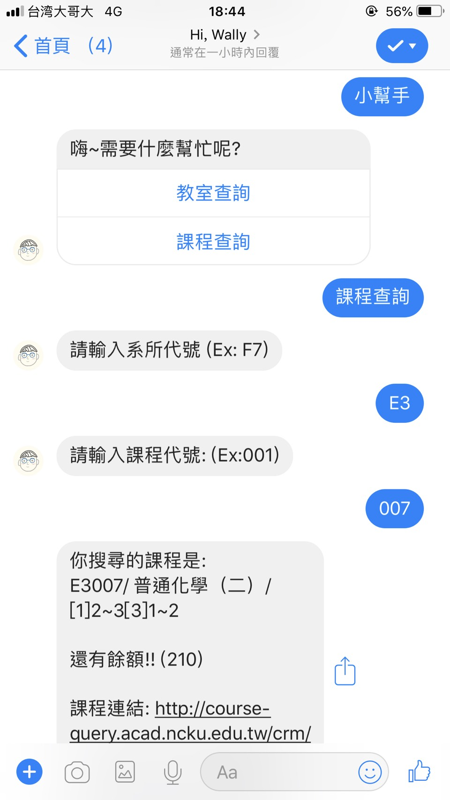
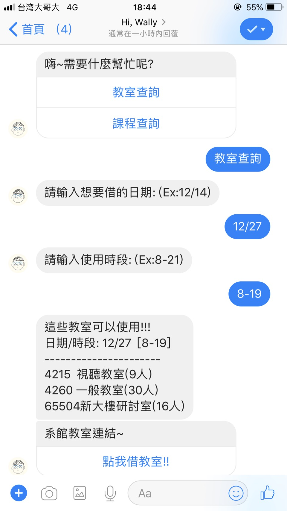
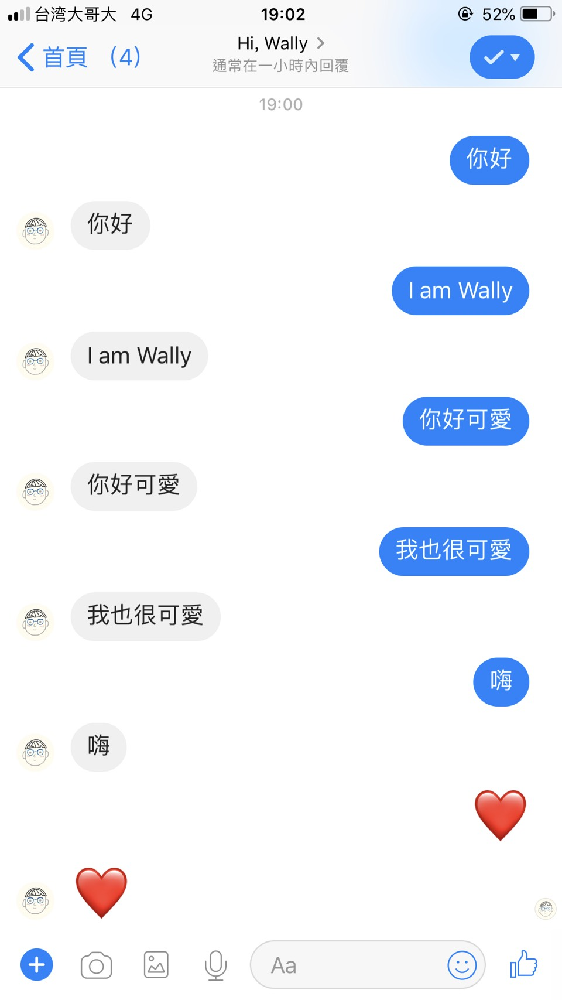
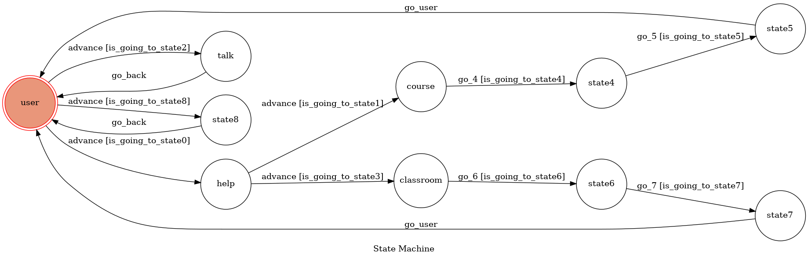

# TOC Project 2019

A Facebook messenger bot based on a finite state machine

### Chat Box 功能:
* 成大課程查詢
* NCKU CSIE 借教室 
* 模仿你講話

## Quickstart
### 成大課程查詢
1. 輸入"小幫手"，選擇"課程查詢"按鈕
2. 輸入想要查詢的系所代號
3. 輸入想要查詢的課程代碼
4. 回傳搜尋結果(餘額/課程連結)
5. 如果還有餘額，會再回傳成大選課系統的連結

### NCKU CSIE 借教室 
1. 輸入"小幫手"，選擇"教室查詢"按鈕
2. 輸入想要查詢的日期
3. 輸入想要查詢的時段
4. 回傳搜尋的結果(可以使用的教室/系館借教室的連結)

### 模仿你講話
1. 你輸入的對話，回傳給你

### Setup
* Python 3
* Facebook Page and App
* HTTPS Server
* Beautifulsoup

## FSM Graph

